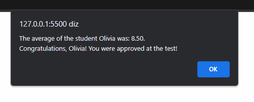

# StudentsAverage2
In this simple project, I explored more of the functions and objects, giving the average of 20 students.

Furthermore, it uses a for, if and some strategies I learned.

The project is available at: 

